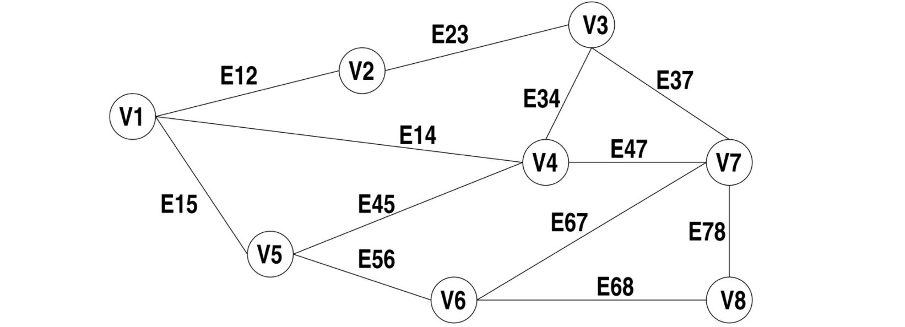

# AIFA Assignment 1

### Group Members:

| Roll Number   | Name              |
|:-------------:|:-----------------:|
| 18EE10025     | Yash Kulkarni     |
| 18EE10043     | Rhitvik Sinha     |
| 18EE30021     | Pratyush Jaiswal  |
| 18EE30029     | Nuruddin Jiruwala |

### Problem chosen for assignment:

**Electric Vehicle**

Consider a city network where we need to route a set of electric vehicles
which may require to be charged during its journey from some source to some destination. Let
us assume that we have n cities (`v1`, `v2`, . . . , `vn`) and the distance between cities `vi` and `vj` be
`eij` (if two cities are not connected directly then `eij = ∞` and `eij = eji`). Assume that each city
has a single charging station which can charge one EV at a time. Consider a set of `k` EVs namely
`P1`, `P2`, . . . , `Pk`. For each EV the following information is provided -

(a) `Sr` - source node  
(b) `Dr` - destination node  
(c) `Br` - battery charge status initially  
(d) `cr` - charging rate for battery at a charging station (energy per unit time)  
(e) `dr` - discharging rate of battery while traveling (distance travel per unit charge)  
(f) `Mr` - maximum battery capacity  
(g) `sr` - average traveling speed (distance per unit time).

Assume that all vehicles start their journey at `t = 0` and `Pr` reaches it destination at `t = Tr`. We
need to route all the vehicles from their respective sources to destinations such that `max{Tr}`
is minimized. You need to develop both optimal as well as heuristic algorithms.

### Installation Guide:

- Python 3.X is used. [Download here](https://www.python.org/downloads/)

### Files uploaded:

- Source Code [here](code.py).
- User Manual / Report [here](AIFA%20Assignment%201%20Report.pdf). Or view on [Google Docs](https://docs.google.com/document/d/1-F-gcmsqUm3AXGeSysvbtCNyMwWNEtCzMNsTObWTwN0/edit?usp=sharing).